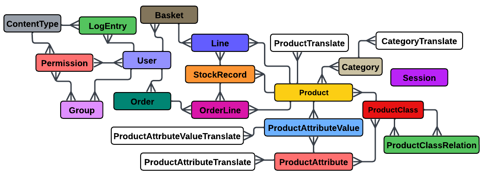

# Django E-Commerce Project

An advanced eCommerce platform built with Django, offering robust features, a seamless shopping experience, and scalability for businesses of all sizes.



## Installation

Follow these steps to set up the project locally:

1. Clone the repository:
   ```bash
   git clone https://github.com/zariny/ecommerce.git
   cd ecommerce
2. And run it locally:

   > python manage.py runserver
   