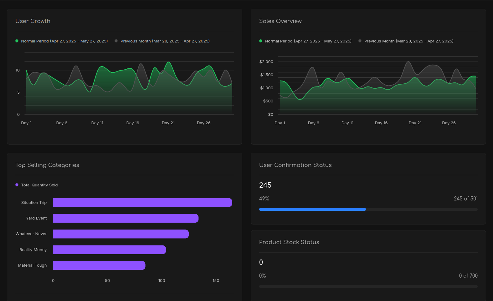

## Django E-Commerce Project

<p align="center">
  
   

</p>
An advanced eCommerce platform built with Django, offering robust features, a seamless shopping experience, and scalability for businesses of all sizes.

## This project also has a UI design, which is available in [this repository.](https://github.com/taymakz/zariny-ecommerce-dashboard)

[This project](https://github.com/taymakz/zariny-ecommerce-dashboard) is the administrative interface for managing the e-commerce platform. It allows administrators to manage products.




## Table of Contents
- [Documentation](#Documentation)
- [Features](#Features)
- [Installation](#Installation)
- [License](#License)


## Documentation


## Features
- **Full REST API project**
- **JWT Authentication system via Http-only cookies**
- **WebSocket support for real-time communication**
- **Documented API for better usability**
- **Hierarchy in product classes**
- **Modern EAV design**
- **Multi-language support**

## Installation

Follow these steps to set up the project locally:

1. Clone the repository:
   ```bash
      git clone https://github.com/zariny/ecommerce.git
      cd ecommerce

2. If you have docker-compose you can run with only one command: 
   ```bash
      docker-compose up
   
- superuser email: root@email.com
- superuser password: root
   
3. Or run project via manage.py locally:
   ```bash
      pip install -r requirements.txt
      python sandbox/manage.py runserver


## License
Read the [license](https://github.com/zariny/ecommerce/blob/master/LICENSE).
